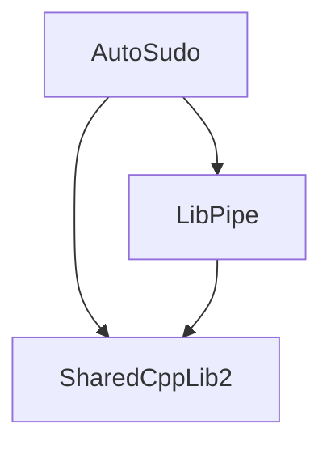

# Auto Sudo Document


## Dependency Graph
AutoSudo depends on two main libraries: LibPipe for inter-process communication and SharedCppLib2 for shared utilities. The following graph illustrates the dependencies:



To build the project yourself, you should follow the instructions in SharedCppLib2/doc/cmake to build and install SharedCppLib2 and LibPipe in sequence.


## Command Line Usage

```bash
AutoSudo --help       # Show help message

AutoSudo --admin cmd.exe    # Run cmd.exe with administrator privileges
AutoSudo --system notepad.exe # Run notepad.exe with system privileges
AutoSudo --user powershell.exe # Run powershell.exe with user privileges

AutoSudo cmd.exe # Default permission level is admin.

AutoSudo --delete cmd.exe   # Remove cmd.exe from the allow list
```

Check [AutoSudoW](#AutoSudoW) for usage in non-command-line environments.

>[!NOTE]
>The order of arguments do matter. The privilage level should be placed directly before the executable, and whatever after the level flag is considered as the command line of the executable. If you do need to use `--debug`, it must be placed before the level flag and the executable.
>
> For example, `AutoSudo --debug --admin cmd.exe` is correct, while `AutoSudo --admin --debug cmd.exe` is incorrect, and the command line will be `--debug cmd.exe`, which will not work.
>
> Also, that is to say the command line can be inputed directly without wrapping it up with quotes. So autosudo acts like a package command, where you can put AutoSudo directly in front of the original command line and it will work.

The program path is translated to an absolute path before sending to the service. So the command is searched under these directories in order:
- Current working directory
- Directories in PATH environment variable

An exception is when the program is passed in by full path with quotes. In this case the search will not happen, nor the existance will be verified.

The process is then started within the **same** context as the scope AutoSudo is ran with. The "context" includes the running path, and the environment variables.

The authenticated level is restrictive "downwards". If an executable does not have an entry in the .authlist file, or the requested permission level is higher than that is approved in the .authlist file, the service will pop up a confirmation dialog to ask the user whether to allow this request.

If user allowed the request, the service will update the .authlist to allow this executable to be launched with the requested or lower permission level in the future without asking for confirmation. If user denied the request, the service will not update the .authlist, and the request will be rejected.

The program verifies the hash of the executable to prevent it being modified after being approved. If the hash does not match, the service will ask user to confirm again. This happens when the executable is updated.

It is also possible to delete a specific entry. There is currently no way to downscale the permission level, so you should delete it and then add it again with the desired permission level. When deleting, specify the executable the same way as when executing, and full path is used to match. If the executable does not exist in the filesystem anymore, you have to use the full path, otherwise the match will always fail.


In current version of AutoSudo (Command Line Version), the started process is automatically forwarded to the current terminal. It works like sudo.


There isn't a way to approve a single request without automatically approving future requests. And it is also not planned. If you do need this feature, check sudo on Windows 11. You can find it in the Settings > System > Advanced > Sudo. Use runmode "inline" to get a linux sudo-like experience.

>[!WARNING]
>**Security warning:** The "inheritConsole" (inline mode for sudo) feature is dangerous because a program in user space can easily take over a subprocess with higher privileges, and for AutoSudo it can be up to system (Ring0). It is not recommended to add any script engine (like cmd, powershell, vbscript) to AutoSudo because they can be easily exploited. This is only an **experimental** feature, and is **NOT SAFE**.

AutoSudo's authlist **does not** contain information or limitation for the command line arguments. So if an executable is approved, it can be launched with any command line arguments without asking for confirmation.

This can also be used to exploit the system easily, if the approved executable can do something with specific arguments. (like powershell or cmd, which can directly run inline code by argument input).

## About .authlist

.authlist is a configuration file that is in the same directory as the service executable. It contains rules that specify which executables can be launched with elevated privileges, and under what conditions. Each line in the .authlist file represents a rule with the following format:

```
file_path|level|hash
```

It is not suggested to edit the .authlist file manually. If you do so, make sure the service is stopped before editing, otherwise the changes will be overwritten by the service when it is stopped or when a new rule is added.


## Service Management

### Install

You should put all the executables contained in this project in the same directory. Something like `C:\Program Files\AutoSudo\bin` is recommended. You should then add this directory to PATH.

To install the service, run the following command in an elevated command prompt (Run as administrator):

```bash
AutoSudo --install
```

### Uninstall

To uninstall the service, run the following command in an elevated command prompt (Run as administrator):

```bash
AutoSudo --uninstall
```

### Start

To start the service, run the following command in an elevated command prompt (Run as administrator):

```bash
AutoSudo --start
```

### Stop

To stop the service, run the following command in an elevated command prompt (Run as administrator):

```bash
AutoSudo --stop
```

### Status

Status is currently not supported, but it is a planned feature. The query command is expected to be:

```bash
AutoSudo --status
```

The return is expected to contain following information:
- Whether the service is running
- The PID of the service process
- The number of processed requests since last time the service is started (approved/auto approved/all)
- The number of entries in the .authlist file
- The system memory usage of the service process


## AutoSudoW

AutoSudoW is a non-command-line version of AutoSudo. It is designed for the use case when user starts the request by a shortcut or a GUI application. This prevents user from seeing the console window popup during the request.

The commandline works exactly the same as AutoSudo.